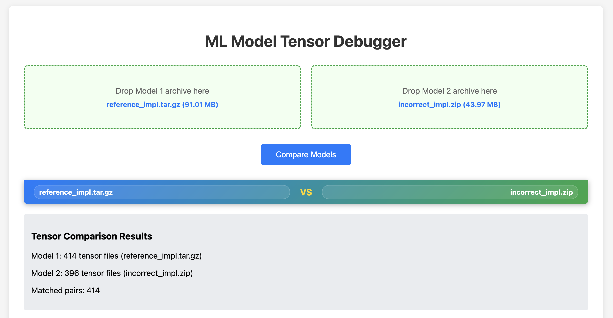
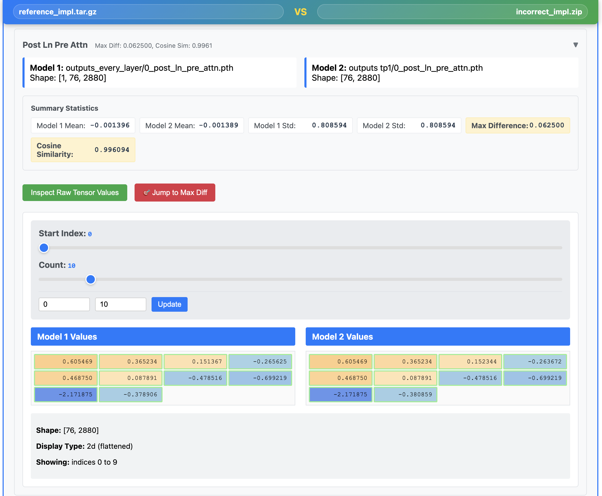
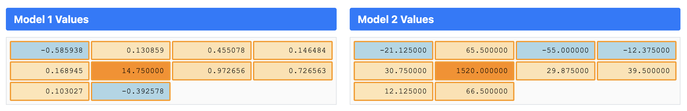

# 🔍 ML Model Tensor Debugger

🚀 **A powerful local web application for debugging and comparing PyTorch tensor outputs between two ML models.**

Ever wondered why your model outputs don't match? Spent hours trying to figure out which tensor went wrong? This tool makes tensor debugging a breeze! 🌟

✨ **This whole app was built with Claude Code in just one evening!** ⚡

## 📸 Screenshots

Get a glimpse of the intuitive interface that makes tensor debugging actually enjoyable:

### 🎯 Clean, Professional Interface
The main interface features a floating header, drag-and-drop uploads, and expandable tensor comparisons:


### ✅ Perfect Model Matches
When your models are working correctly, you'll see beautiful green borders indicating minimal differences. The interface clearly shows tensor shapes, statistics, and provides easy navigation through your data:


### 🚨 Debugging Mode: Finding the Problem
When something's wrong, the tool lights up like a Christmas tree! Orange borders and color-coded values instantly highlight where your tensors diverge. The "Jump to Max Diff" feature takes you straight to the problematic values:


*Notice how the interface makes it immediately obvious where the issues are - no more hunting through endless tensor dumps in your terminal!* 🎯

## Features

- **Drag & Drop Interface**: Upload .zip or .tar.gz archives containing PyTorch tensor files
- **Automatic Tensor Matching**: Pairs tensors between models based on filename patterns
- **Tensor Parallel Support**: Smart reshaping for different TP settings (e.g., 8 vs 1)
- **Interactive Value Inspection**: Navigate tensor values with sliders and color-coded visualization
- **Statistical Comparison**: Calculates difference metrics (MSE, cosine similarity, etc.)
- **Collapsible Interface**: Clean overview with expandable tensor comparisons
- **Floating Header**: Always-visible model names during scrolling
- **Color-Coded Values**: Blue/orange backgrounds for negative/positive, green/orange borders for differences
- **Jump to Max Diff**: Automatically navigate to highest difference locations
- **Completely Local**: No data leaves your machine

## Setup

1. Create and activate conda environment:
```bash
conda create -n ml-debug-viz python=3.12 -y
conda activate ml-debug-viz
```

2. Install dependencies:
```bash
pip install -r requirements.txt
```

Or manually:
```bash
pip install flask==2.3.3 torch==2.2.2 numpy==1.24.3 plotly==5.17.0 werkzeug==2.3.7
```

## Usage

1. Start the application:
```bash
python app.py
```

2. Open your browser to `http://127.0.0.1:5000`

3. Drag and drop your model archives:
   - Model 1: Archive containing tensors like `3_post_attn_pre_resid.pth`, `3_post_ln_pre_attn.pth`, etc.
   - Model 2: Archive containing tensors like `0_post_attn_pre_resid.pth`, `0_post_ln_pre_attn.pth`, etc.

4. Click "Compare Models" to analyze differences

## File Structure Expected

Your tensor files should follow naming patterns like:
- `{layer}_{stage}.pth` where `{layer}` is the layer number (0, 1, 2, etc.)

### Supported Stages (in display order):
1. **`post_ln_pre_attn`** - After layer norm, before attention
2. **`query`** - Query vectors  
3. **`query_final`** - Final query vectors
4. **`key`** - Key vectors
5. **`key_final`** - Final key vectors  
6. **`value`** - Value vectors
7. **`value_final`** - Final value vectors
8. **`post_attn`** - After attention computation
9. **`scaling`** - Scaling parameters (often scalar values)
10. **`sliding`** - Sliding parameters (often scalar values)
11. **`post_attn_pre_resid`** - After attention, before residual
12. **`pre_mlp`** - Before MLP/feed-forward layer
13. **`post_mlp`** - After MLP/feed-forward layer

### Example Files:
```
model_outputs.zip
├── 0_post_ln_pre_attn.pth
├── 0_query.pth
├── 0_query_final.pth
├── 0_key.pth
├── 0_key_final.pth
├── 0_value.pth
├── 0_value_final.pth
├── 0_post_attn.pth
├── 0_scaling.pth
├── 0_sliding.pth
├── 0_post_attn_pre_resid.pth
├── 0_pre_mlp.pth
├── 0_post_mlp.pth
├── 1_post_ln_pre_attn.pth
└── ... (additional layers)
```

The app matches tensors based on the stage name (everything after the layer number and underscore).

## Advanced Features

### Tensor Parallel Compatibility
- **Smart Reshaping**: Automatically handles different tensor parallel settings (e.g., TP=8 vs TP=1)
- **Transpose Detection**: Finds dimension swaps that preserve tensor semantics (preserves last dimension)
- **Rank Zero Truncation**: Handles cases where one model has extra data from rank 0
- **Shape Compatibility**: Works with various tensor shapes and automatically finds compatible representations

### Interactive Tensor Inspection  
- **Color-Coded Values**: 
  - Background colors: Light blue (negative) → Light orange (positive) with magnitude-based gradients
  - Border colors: Light green (low difference) → Orange (high difference)
- **Smart Navigation**: 
  - Sliders for exploring tensor value ranges
  - "Jump to Max Diff" buttons that automatically navigate to the argmax of absolute differences
  - Collapsible interface for managing many tensor comparisons
- **Value Tooltips**: Hover to see exact values, indices, and difference magnitudes

### Statistical Analysis
- **Absolute Difference Mean/Max**: Raw tensor differences
- **Relative Difference Mean**: Normalized by tensor magnitude  
- **MSE**: Mean squared error between tensors
- **Cosine Similarity**: Similarity in tensor direction (-1 to 1)
- **Shape Analysis**: Detailed reporting of tensor shapes and any applied transformations
- **NaN/Inf Handling**: Robust statistics calculation that handles edge cases

## File Limits

- Maximum file size: 500MB per archive
- Supports .zip, .tar.gz, and .tgz formats

## Interface Guide

### Getting Started
1. **Upload**: Drag and drop two archive files containing your tensor outputs
2. **Overview**: Results appear collapsed by default - click any header to expand details
3. **Navigation**: Use the floating header to always see which models you're comparing
4. **Explore**: Click "Inspect Raw Tensor Values" to see individual tensor elements
5. **Focus**: Use "Jump to Max Diff" to automatically find the most significant differences

### UI Elements
- **Floating Header**: Sticky bar showing model filenames (appears after upload)
- **Collapsible Sections**: Click any tensor stage header to expand/collapse
- **Collapse All / Expand All**: Bulk operations for managing many comparisons  
- **Color Legend**:
  - Blue cells: Negative values (darker = larger magnitude)
  - Orange cells: Positive values (darker = larger magnitude)
  - Green borders: Low differences between models
  - Orange borders: High differences between models

## Technical Notes

- **PyTorch Compatibility**: Uses PyTorch 2.2.2 with distributed features for modern tensor file loading
- **Memory Efficient**: Tensors are processed incrementally and not stored in frontend
- **Error Handling**: Robust handling of shape mismatches, NaN values, and compatibility issues
- **Performance**: Optimized for comparing large numbers of tensor files across many layers